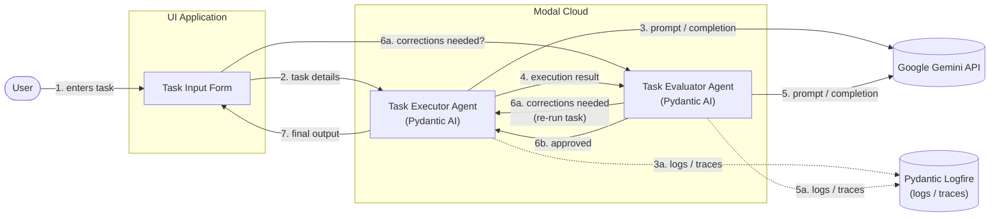

# agent-lenses
Watch AI agents stay on track.

## Overview
**agent-lenses** is a real-time AI agent monitoring and observability platform. It allows users to run multi-step agent loops (Checklist Creator → Executor → Evaluator) and observe thought processes, verification steps, and execution status live over Server-Sent Events (SSE) with Logfire tracing.


## System Overview

The system is composed of three main components:

1. **UI Application** – collects task input from the user and kicks off a run.
2. **Task Executor Agent** – a Pydantic AI agent, performing the task using the Google Gemini API.
3. **Task Evaluator Agent** – a Pydantic AI agent, evaluating the executor's output using the Google Gemini API.

The Task Executor Agent and Task Evaluator Agent are both deployed together within the same **Modal Cloud** deployment. Both agents send logs/traces to **Logfire** for observability.

The Task Evaluator Agent always reports back to the Task Executor Agent: either that corrections are needed (triggering a re-run of the task) or that the result is approved. Separately, while corrections are in progress, the UI polls the evaluator to check whether corrections are needed. The Task Executor Agent sends the final output back to the UI.

## Diagram

Arrow labels are numbered to show the order in which messages happen. Steps `6a`/`6b` are alternatives (corrections vs. approved), and `6a` loops back to `3`. Steps `3a`/`5a` (logging) and `7` (final output to UI) happen alongside their neighboring step rather than strictly after it. `6a` between the UI and evaluator is a pull — the UI asks the evaluator for correction status.



## Flow

1. The **user** enters task details into the **UI application**.
2. The UI sends the task details to the **Task Executor Agent** running in the **Modal Cloud** deployment.
3. The Task Executor Agent (Pydantic AI) calls the **Google Gemini API** to execute the task. (3a) It sends execution logs/traces to **Logfire**.
4. The Task Executor Agent sends its execution result to the **Task Evaluator Agent**, running in the same Modal Cloud deployment.
5. The Task Evaluator Agent (Pydantic AI) calls the **Google Gemini API** to evaluate the execution result. (5a) It sends evaluation logs/traces to **Logfire**.
6. The Task Evaluator Agent reports back: (6a) if corrections are needed, it notifies the **Task Executor Agent**, which re-runs the task incorporating the corrections (back to step 3) — meanwhile the UI polls the evaluator asking whether corrections are needed; (6b) otherwise it signals approval to the executor.
7. Once approved, the **Task Executor Agent** sends the final output to the UI to be shown to the user.

## Components

| Component | Responsibility | Framework | Deployment | LLM Provider | Observability |
|---|---|---|---|---|---|
| UI Application | Collect task input, display corrections in progress and final output | — | — | — | — |
| Task Executor Agent | Execute the task, re-run with corrections when requested by the evaluator, return final output to the UI | Pydantic AI | Modal Cloud (shared deployment) | Google Gemini API | Logfire |
| Task Evaluator Agent | Evaluate the executed task, request corrections or approve the result, respond to UI polling on correction status | Pydantic AI | Modal Cloud (shared deployment) | Google Gemini API | Logfire |


---

## Architecture & Services

The system connects UI task inputs, Pydantic AI agents, and real-time observability:

- **`apps/web/`** — Next.js UI application for user interaction, task input, and polling execution/evaluator progress.
- **`script.py` & Modal Cloud** — Python backend/agents (Executor and Evaluator) running via Modal and Pydantic AI Gateway, traced using Logfire.
- See [sources.md](./sources.md) for full details on data sources, references, and attribution.

---

## Prerequisites

- **Node.js**: `v20+` and `npm`
- **Python**: `>= 3.11`
- **Package & CLI Tools**:
  - `uv` (installed via Homebrew or official installer)
  - `modal` CLI (installed via Homebrew or `pip install modal`)
- **External Accounts**:
  - Modal account (with active GPU credits)
  - Logfire account with Pydantic AI Gateway enabled

---

## Quick Setup Instructions

### 1. Web Frontend (`apps/web`)

1. **Navigate to the web app directory**:
   ```bash
   cd apps/web
   ```

2. **Install dependencies**:
   ```bash
   npm install
   ```

3. **Start the development server**:
   ```bash
   npm run dev
   ```
   Open [http://localhost:3000](http://localhost:3000) in your browser.

---

### 2. Python Agent Demo (Modal & Pydantic AI Gateway)

1. **Authenticate Modal** (opens browser authentication):
   ```bash
   modal setup
   ```

2. **Create a Proxy Token**:
   ```bash
   modal workspace proxy-tokens create
   ```
   Save the displayed Token ID (`wk-…`) and Secret (`ws-…`). If environment-scoped:
   ```bash
   modal workspace proxy-tokens allow <token-id> main
   ```

3. **Deploy the Inference Endpoint**:
   Select a model repo ID from Hugging Face (e.g., `google/gemma-3-1b-it` or `google/gemma-4-31B-it`):
   ```bash
   modal endpoint create --name gateway --model <MODEL>
   ```
   Verify status with `modal endpoint list` (provisioning takes a few minutes).

4. **Copy Endpoint URL**:
   Retrieve the dedicated URL from your [Modal Endpoints Dashboard](https://modal.com/endpoints):
   `https://<workspace>--ep-<name>-server.<region>.modal.direct`

5. **Configure BYOK Provider in Logfire Gateway**:
   In Logfire Gateway → Add Provider:

   | Field | Value |
   |---|---|
   | Provider name | `agentlenses-provider` (must match `route` in `script.py`) |
   | Base URL | `<endpoint-url-from-step-4>/v1` |
   | Proxy token ID | `wk-…` (from step 2) |
   | Proxy token secret | `ws-…` (from step 2) |

6. **Environment Configuration**:
   Copy `.env.example` to `.env`:
   ```bash
   cp .env.example .env
   ```
   Set the following variables:
   - `PYDANTIC_AI_GATEWAY_BASE_URL` — Gateway root URL without route suffix.
   - `PYDANTIC_AI_GATEWAY_API_KEY` — Your Logfire Gateway key.
   - `LOGFIRE_TOKEN` — Logfire project write token (Logfire → Settings → Write tokens).

7. **Run the Script**:
   Ensure `MODEL` inside `script.py` matches the model deployed in Step 3, then execute:
   ```bash
   uv run --env-file .env script.py
   ```
   First run prints the Logfire trace URL and agent output.