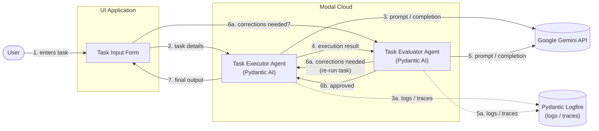

# Architecture

## Overview

The system is composed of three main components:

1. **UI Application** – collects task input from the user and kicks off a run.
2. **Task Executor Agent** – a Pydantic AI agent, performing the task using the Google Gemini API.
3. **Task Evaluator Agent** – a Pydantic AI agent, evaluating the executor's output using the Google Gemini API.

The Task Executor Agent and Task Evaluator Agent are both deployed together within the same **Modal Cloud** deployment. Both agents send logs/traces to **Logfire** for observability.

The Task Evaluator Agent always reports back to the Task Executor Agent: either that corrections are needed (triggering a re-run of the task) or that the result is approved. Separately, while corrections are in progress, the UI polls the evaluator to check whether corrections are needed. The Task Executor Agent sends the final output back to the UI.

## Diagram

Arrow labels are numbered to show the order in which messages happen. Steps `6a`/`6b` are alternatives (corrections vs. approved), and `6a` loops back to `3`. Steps `3a`/`5a` (logging) and `7` (final output to UI) happen alongside their neighboring step rather than strictly after it. `6a` between the UI and evaluator is a pull — the UI asks the evaluator for correction status.

## Flow

1. The **user** enters task details into the **UI application**.
2. The UI sends the task details to the **Task Executor Agent** running in the **Modal Cloud** deployment.
3. The Task Executor Agent (Pydantic AI) calls the **Google Gemini API** to execute the task. (3a) It sends execution logs/traces to **Logfire**.
4. The Task Executor Agent sends its execution result to the **Task Evaluator Agent**, running in the same Modal Cloud deployment.
5. The Task Evaluator Agent (Pydantic AI) calls the **Google Gemini API** to evaluate the execution result. (5a) It sends evaluation logs/traces to **Logfire**.
6. The Task Evaluator Agent reports back: (6a) if corrections are needed, it notifies the **Task Executor Agent**, which re-runs the task incorporating the corrections (back to step 3) — meanwhile the UI polls the evaluator asking whether corrections are needed; (6b) otherwise it signals approval to the executor.
7. Once approved, the **Task Executor Agent** sends the final output to the UI to be shown to the user.

## Components

| Component | Responsibility | Framework | Deployment | LLM Provider | Observability |
|---|---|---|---|---|---|
| UI Application | Collect task input, display corrections in progress and final output | — | — | — | — |
| Task Executor Agent | Execute the task, re-run with corrections when requested by the evaluator, return final output to the UI | Pydantic AI | Modal Cloud (shared deployment) | Google Gemini API | Logfire |
| Task Evaluator Agent | Evaluate the executed task, request corrections or approve the result, respond to UI polling on correction status | Pydantic AI | Modal Cloud (shared deployment) | Google Gemini API | Logfire |
