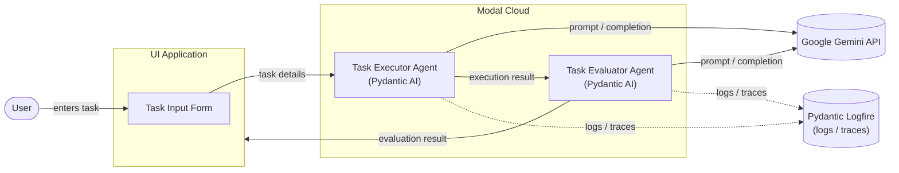

# Architecture

## Overview

The system is composed of three main components:

1. **UI Application** – collects task input from the user and kicks off a run.
2. **Task Executor Agent** – a Pydantic AI agent, performing the task using the Google Gemini API.
3. **Task Evaluator Agent** – a Pydantic AI agent, evaluating the executor's output using the Google Gemini API.

The Task Executor Agent and Task Evaluator Agent are both deployed together within the same **Modal Cloud** deployment. Both agents send logs/traces to **Logfire** for observability.

## Diagram

## Flow

1. The **user** enters task details into the **UI application**.
2. The UI sends the task details to the **Task Executor Agent** running in the **Modal Cloud** deployment.
3. The Task Executor Agent (Pydantic AI) calls the **Google Gemini API** to execute the task, and sends execution logs/traces to **Logfire**.
4. The executor's output is passed to the **Task Evaluator Agent**, running in the same Modal Cloud deployment.
5. The Task Evaluator Agent (Pydantic AI) calls the **Google Gemini API** to evaluate the execution result, and sends evaluation logs/traces to **Logfire**.
6. The evaluation result is returned to the UI to be shown to the user.

## Components

| Component | Responsibility | Framework | Deployment | LLM Provider | Observability |
|---|---|---|---|---|---|
| UI Application | Collect task input, display results | — | — | — | — |
| Task Executor Agent | Execute the task | Pydantic AI | Modal Cloud (shared deployment) | Google Gemini API | Logfire |
| Task Evaluator Agent | Evaluate the executed task | Pydantic AI | Modal Cloud (shared deployment) | Google Gemini API | Logfire |
